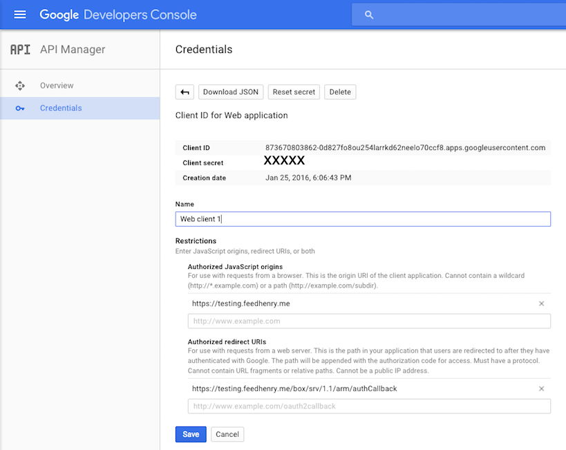
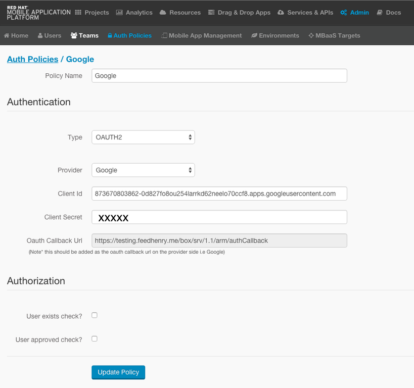
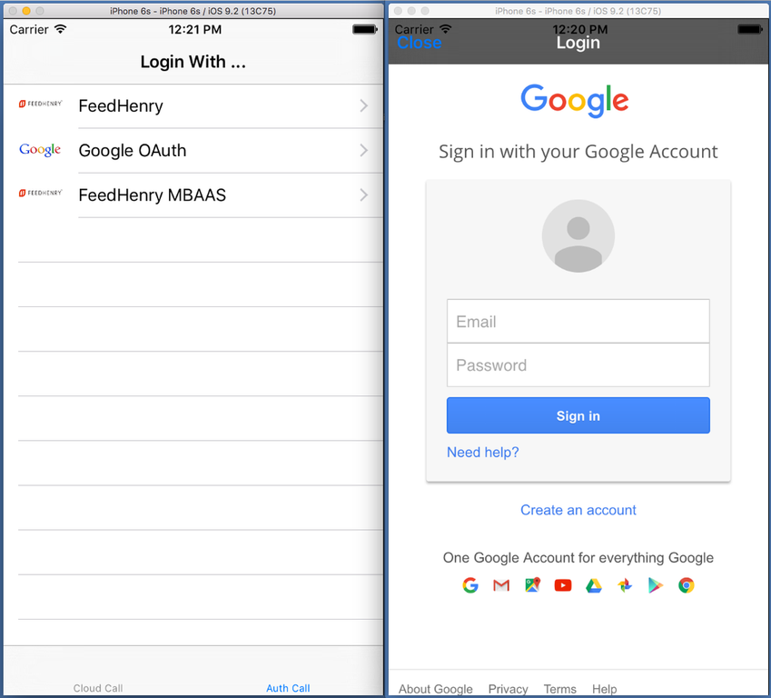

# oauth-ios-app [](https://travis-ci.org/feedhenry-templates/oauth-ios-app)

Author: Corinne Krych   
Level: Intermediate  
Technologies: Objective-C, iOS, RHMAP, cocoapods.
Summary: A demonstration of how to use oauth usage with RHMAP. 
Community Project : [Feed Henry](http://feedhenry.org). **Community Only, not available as template in RHMAP.**
Target Product: RHMAP  
Product Versions: RHMAP 3.7.0+   
Source: https://github.com/feedhenry-templates/oauth-ios-app  
Prerequisites: fh-ios-sdk : 3.+, Xcode : 7.2+, iOS SDK : iOS7+

## What is it?

Simple OAuth demo to see how to use OAuth2 external providers like Google to authenticate in RHMAP.  The user can choose ina list of auth providers: Google, RHMAP OAuth2 service to perform authentication and authorisation in RHMAP.

If you do not have access to a RHMAP instance, you can sign up for a free instance at [https://openshift.feedhenry.com/](https://openshift.feedhenry.com/).

## How do I run it?  

### RHMAP Studio

This is a community project. It is not available in RHMAP, but you can easely used it in RHMAP doing the following steps:
- create a blank project in RHMAP
- follow local Clone instructions.

### Local Clone (ideal for Open Source Development)
If you wish to contribute to this template, the following information may be helpful; otherwise, RHMAP and its build facilities are the preferred solution.

## Build instructions

1. Clone this project

2. Populate ```FHAuthDemo/fhconfig.plist``` with your values as explained [here](http://docs.feedhenry.com/v3/dev_tools/sdks/ios.html#ios-configure).

3. Run ```pod install```

4. Open FHAuthDemo.xcworkspace

5. Run the project
 
## How does it work?

### Set up Google provider
To set up the example to worl with Gloogle OAuth2 provider, go in:

* [Google dev console](https://console.developers.google.com/):
Create a web credentials, add the callback URL as shown below:


* in RHMAP:
Go to ```Admin > Auth Policies```, select the ```Create``` button.


### Set up FHAuthDemo

In ```FHAuthDemo/FHLoginViewController.m```:

```
- (void)viewDidLoad
{
  self.navigationItem.title = @"Login With ...";
  [super viewDidLoad];
  AuthMethod* googleauth = [[GoogleAuthMethod alloc] initWithName:@"Google OAuth" icon:@"auth_google" policyId:@"Google"]; // [1]
  self.authMethods = @[googleauth;
    
  [authList reloadData];
}
```

[1] Make sure ```Google``` matches the name you entered in RHMAP configuration.

### Running the app



### iOS9 and non TLS1.2 backend

If your RHMAP is deployed without TLS1.2 support, open as source  ```FHAuthDemo/FHAuthDemo-Info.plist``` add the exception lines:

```
  <key>NSAppTransportSecurity</key>
  <dict>
    <key>NSAllowsArbitraryLoads</key>
    <true/>
  </dict>
```